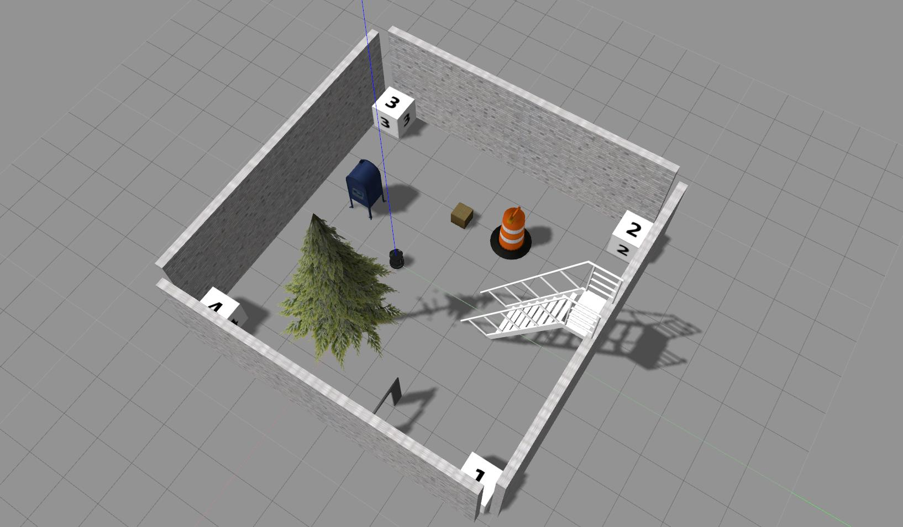
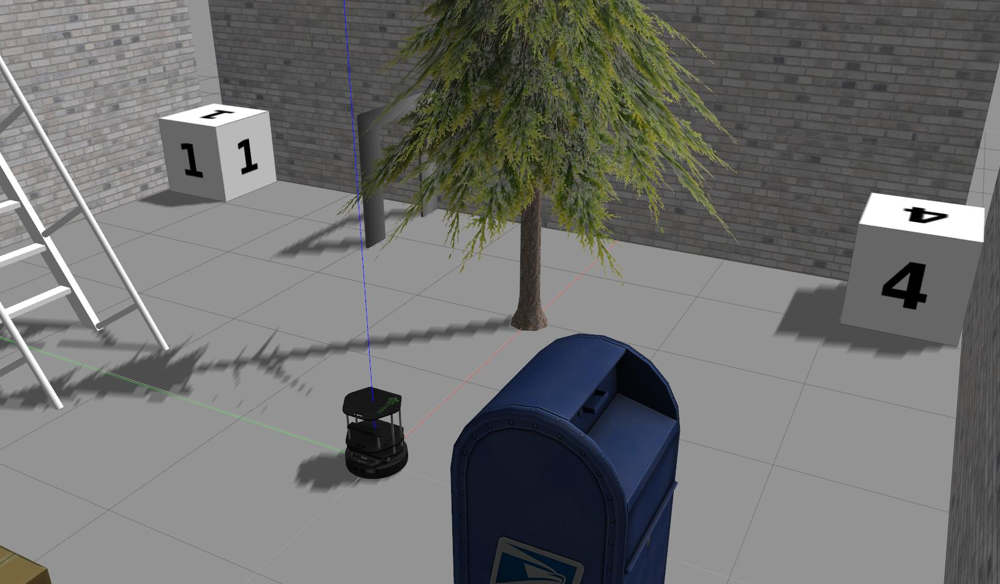

<h1 align="center"> Gazebo Tutorial: Simple demonstration of a simulated enivronment
</h1>
ENPM808x Week12 HomeWork - ROS Programming Assignment

[](https://opensource.org/licenses/BSD-3-Clause)
---

## Overview

Agenda of this simple implementation is the demonstration of Gazebo simulation environment. A turtlebot is shown moving around avoiding obstacles in the simulation world. The data from laser sensor is used to avoid obstacles.

The launch file invokes the gazebo simulation node, the roomba_walker node, and an additional node to record all rostopics except the camera data. 

## Dependencies

This package has been tested in a system with following dependencies.
- Ubuntu 16.04 LTS
- ROS-Kinetic distro
- Gazebo version 7

## Build Instructions

1) Install ROS-Kinetic (http://wiki.ros.org/kinetic/Installation/Ubuntu)
2) Install gazebo for ROS kinetic:
```
sudo apt-get install ros-kinetic-gazebo-ros-pkgs ros-kinetic-gazebo-ros-control
```
3) Install turtlebot simulator:
```
sudo apt-get install ros-kinetic-turtlebot-gazebo  ros-kinetic-turtlebot-apps ros-kinetic-turtlebot-rviz-launchers
```
5) Clone the repository:
```
source /opt/ros/kinetic/setup.bash
mkdir -p ~/catkin_ws/src
cd ~/catkin_ws/src
git clone https://github.com/satyarth934/roomba_walker.git
cd beginner_tutorials
```

3) Build and source the package:
```
cd ~/catkin_ws
catkin_make
source devel/setup.bash
```

## Run Instructions
### Services and Logging 

1) Launch the launch file which start three nodes - Gazebo Simulation, roomba_walker, RosbagRecorder. Rosbag recorder is turned off by default but can be specified if required.
```
roslaunch roomba_walker turtlebot_world.launch recordBag:=false
```
Some snippets of the simulation environment. 
<center>
	
</center>
<center>
	
</center>
<center>
	
</center>

2) To run and view the ros topics from the recorded bag, run the following commands in seperate terminals:
```
roscore
rosbag play results/Data.bag
```
Gazebo should not be running when playing the rosbag.

3) To analyse the recorded rosbag messages, `rqt_bag` tool can be used.
```
rqt_bag results/Data.bag
```

3) In a new terminal, rviz can be run to visualize the output of the sensors on the turtlebot.
```
rviz
```

